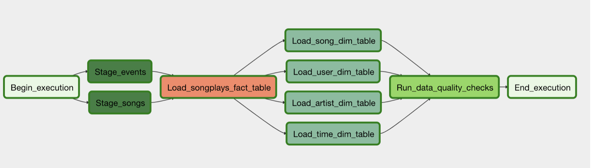

# Project: Data Pipelines with Airflow
A music streaming company, Sparkify, has decided that it is time to introduce more automation and monitoring to their data warehouse ETL pipelines and come to the conclusion that the best tool to achieve this is Apache Airflow.

They have decided to bring you into the project and expect you to create high grade data pipelines that are dynamic and built from reusable tasks, can be monitored, and allow easy backfills. They have also noted that the data quality plays a big part when analyses are executed on top the data warehouse and want to run tests against their datasets after the ETL steps have been executed to catch any discrepancies in the datasets.

The source data resides in S3 and needs to be processed in Sparkify's data warehouse in Amazon Redshift. The source datasets consist of JSON logs that tell about user activity in the application and JSON metadata about the songs the users listen to.

## Solution
Customised Python Airflow Operators were written to load data from AWS S3 into staging tables in Redshift

## Files 
1. `sparkify_dag.py` - The DAG execution file
2. `create_tables.sql` - Contains the SQL statements to create all tables
3. `sql_queries.py` - Contains the SQL statements to insert records into tables
4. `stage_redshift.py` - Custom operator, reads files from AWS S3 and loads them into Redshift staging tables.
5. `load_fact.py` - Custom operator to load records into a fact table in Redshift.
6. `load_dimension.py` - Custom operator to load records into dimension tables from staging tables in Redshift.
7. `data_quality.py` - Custom operator to perform data quality checks.

## Instructions
1. Instantiate Redshift Cluster
2. Using Redshift Editor, run all create table statements in create_tables.sql
3. Add Airflow connections for Amazon Web Services and Red Shift cluster
4. Run Dag
